<div align="center">

# Sai Navaneeth Thota

**AI Engineer · Analytics Professional · Applied AI Builder**

*I build reliable data systems and evidence-first AI products that turn business questions into tested, reproducible answers.*

<br>

### <code>sai@github:~$ ./contributions.sh</code>



<br>

### <code>sai@github:~$ whoami</code>

<table>
  <tr>
    <td valign="top"></td>
    <td valign="top"></td>
  </tr>
</table>

</div>

## `$ cat featured-projects.md`

| Project | What it demonstrates |
| --- | --- |
| **[Agentic BI Copilot](https://github.com/navaneeth9908/agentic-bi-copilot)** | Governed natural-language analytics with safe SQL, metric-glossary grounding, deterministic evaluations, FastAPI, Docker, and CI. |
| **[SEC Financial Research Agent](https://github.com/navaneeth9908/sec-financial-research-agent)** | Production-oriented research over official SEC EDGAR data with cited analytics, XBRL normalization, filing RAG architecture, and evaluation plans. |
| **[Data Analysis Portfolio](https://github.com/navaneeth9908/data-analysis-portfolio)** | Practical analytics and AI projects spanning NL2SQL, automated EDA, report Q&A, competitive intelligence, financial analysis, and research briefings. |
| **[Data Engineering Interview Practice](https://github.com/navaneeth9908/data-engineering-interview-practice)** | Hands-on SQL, pandas, PySpark, ETL, data-quality, reconciliation, and business-case practice using reproducible local datasets. |

## `$ cat principles.txt`

```text
01  Build deterministic paths before adding model-driven behavior.
02  Validate generated SQL, calculations, and source citations.
03  Package work so another engineer can run it from a clean checkout.
04  Treat tests, evaluations, observability, and documentation as product features.
```

## `$ cat stack.txt`

**Core:** Python · SQL · PySpark · pandas · DuckDB<br>
**Applications:** FastAPI · Streamlit · CLI tooling<br>
**AI systems:** Agent workflows · RAG · NL2SQL · evaluations · guardrails<br>
**Delivery:** Docker · GitHub Actions · pytest · reproducible local demos

## `$ contact --open`

- **Email:** [navaneeththota410@gmail.com](mailto:navaneeththota410@gmail.com)
- **Location:** Atlanta, Georgia
- **Interests:** Data engineering, analytics engineering, BI, and applied AI opportunities across the U.S.

<div align="center">

<sub>Profile artwork is generated from self-contained Python scripts and committed SVGs. The public contribution calendar refreshes daily through GitHub Actions.</sub>

</div>
